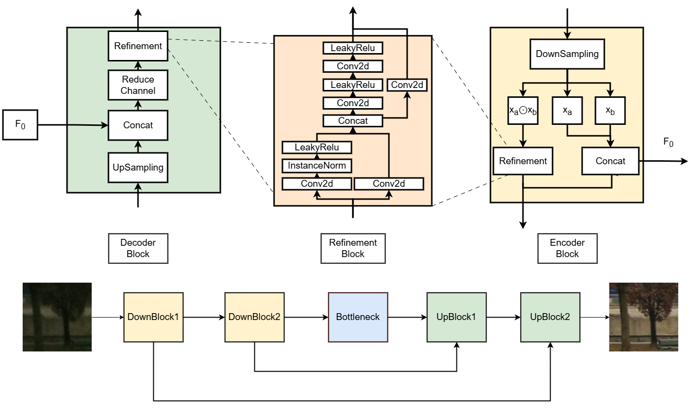

# Bridging the Training-Deployment Gap: Gated Encoding and Multi-Scale Refinement for Efficient Quantization-Aware Image Enhancement

<div align="center">
  <a href="#"><strong>Paper</strong></a> |
  <a href="#"><strong>Dataset</strong></a> |
  <a href="#"><strong>Pretrained Models</strong></a>
</div>

This repository provides the official implementation of **Bridging the Training–Deployment Gap: Gated Encoding and Multi-Scale Refinement for Efficient Quantization-Aware Image Enhancement**. It features `Gated Encoding and Multi-Scale Refinement Network`, a lightweight architecture designed for mobile deployment, supported by Quantization-Aware Training (QAT) and an end-to-end export pipeline to TFLite (FP32 & INT8). 

The project is heavily optimized for evaluating performance (PSNR/SSIM) vs. efficiency (Latency/Model Size) on mobile devices using the DPED dataset.

## Highlights
- **Gated Encoding and Multi-Scale Refinement Architecture:** A lightweight and efficient architecture designed specifically for mobile image enhancement.
- **Quantization-Aware Training (QAT):** End-to-end pipeline supporting FX Graph Mode QAT for optimal INT8 deployment without significant performance degradation.
- **Seamless Deployment Pipeline:** Automated conversion from PyTorch to ONNX, TF SavedModel, and finally to TFLite (FP32 and INT8 PTQ).
- **Comprehensive Benchmarking:** Built-in tools for measuring PSNR, SSIM, latency, and parameter count across PyTorch and TFLite formats

<p align="center">
  
  <br/>
  <em>Figure 1: Overview of the Gated Encoding and Multi-Scale Refinement Network and deployment pipeline.</em>
</p>

## News
- **[2026/04]** The official training, evaluation, and export code is published.
- **[2026/04]** Our paper has been accepted at CVPRW-2026.

## Requirements
**Python < 3.12** (Required to prevent errors during the TFLite conversion process).

Install dependencies via `requirements.txt`:
```bash
pip install -r requirements.txt
```
*(Optional)* For WandB logging, create a `.env` file in the root directory and add your `WANDB_API_KEY`.

## Repository Structure
```text
.
├── benchmark_ckpts.py             # Benchmark Lightning checkpoints (size, metrics, latency)
├── benchmark_quantized.py         # Benchmark exported quantized artifacts (*_int8.pth, .tflite)
├── ckpts_to_int8_tflite_eval.py   # Batch export to INT8 PTQ TFLite and evaluate
├── ckpts_to_tflite_eval.py        # Batch export to FP32 TFLite and evaluate
├── data_aug.py                    # GPU-accelerated augmentations (Kornia)
├── dped_dataset.py                # DPED dataset and PyTorch Lightning DataModule
├── eval_original_images.py        # Per-phone TFLite conversion and evaluation on original images
├── eval_pytorch.py                # PyTorch evaluation utilities (PSNR/SSIM)
├── eval_tflite.py                 # TFLite model evaluation utilities
├── infer_tflite.py                # Single-image inference using TFLite
├── infer_visualize.py             # Visual comparison generation and metric ranking
├── loss.py                        # Loss function implementations (PSNR, MS-SSIM, Content, Outlier)
├── model_builder.py               # HybridMixUNet definition and checkpoint utilities
├── quantize.py                    # Convert checkpoints to FX INT8 (QAT or PTQ)
├── to_tflite.py                   # ONNX -> TF SavedModel -> TFLite conversion pipeline
├── train_qat.py                   # Main training script (FP32/BF16 and QAT)
└── train_utils_builder.py         # Registries for Loss functions and LR Schedulers
```

## Training
You can train the model from scratch or use Quantization-Aware Training (QAT). The training script is fully integrated with PyTorch Lightning and Weights & Biases (WandB).

Example: QAT with BF16 precision and Cosine Warmup
```bash
python train_qat.py \
  --model_name model_c32_loss02_quantize_norestart \
  --channels 32 \
  --loss_version 2 \
  --precision bf16 \
  --qat True \
  --scheduler_type cosine_warmup \
  --warmup_epochs 5 \
  --warmup_start_factor 0.1 \
  --eta_min 5e-6 \
  --num_epochs 50 \
  --limit_train_batches 0.01 \
  --use_wandb False
```

## Export & Quantization
To deploy the model on mobile devices, export the trained PyTorch checkpoint to TFLite (FP32 or INT8).

Convert to TFLite (FP32)
```bash
python to_tflite.py \
  --ckpt_path /path/to/model.ckpt \
  --channels 24 \
  --output_dir /path/to/results \
  --model_name modelv7_c24
```

Convert to INT8 (PyTorch FX Graph)
```bash
python quantize.py \
  --ckpt_path /path/to/model.ckpt \
  --save_path /path/to/save/int8 \
  --data_dir /path/to/dped 
```

## Evaluation & Benchmarking

### Evaluate Metrics (PSNR / SSIM)
Evaluate a TFLite file:
```bash
python eval_tflite.py \
  --tflite_file /path/to/results/model.tflite \
  --data_dir ./dataset/dped/dped \
  --output_csv /path/to/results/eval_one.csv
```

Evaluate all TFLite files in a directory:
```bash
python eval_tflite.py \
  --tflite_dir /path/to/results \
  --data_dir ./dataset/dped/dped \
  --output_csv /path/to/results/eval_all.csv
```

### Run Benchmarks (Latency & Memory)
To measure the real-world efficiency of your checkpoints:
```bash
# Benchmark PyTorch Checkpoints
python benchmark_ckpts.py \
  --ckpt_dir ./ckpts \
  --data_dir ./dataset/dped/dped \
  --output_csv ./ckpts/benchmark_results.csv

# Benchmark Quantized (INT8/TFLite) Models
python benchmark_quantized.py \
  --model_dir ./results/int8 \
  --data_dir ./dataset/dped/dped
```

## Inference & Visualization
Generate comparison images (Input | Output | Ground Truth) and rank them based on MSSIM or PSNR:
```bash
python infer_visualize.py \
  --metric combined \
  --top_k 10 
```

Run inference on a single high-resolution image using TFLite (supports dynamic padding and tile-based overlapping):
```bash
python infer_tflite.py \
  --tflite_file /path/to/model.tflite \
  --input /path/to/input.jpg \
  --strategy auto
```
